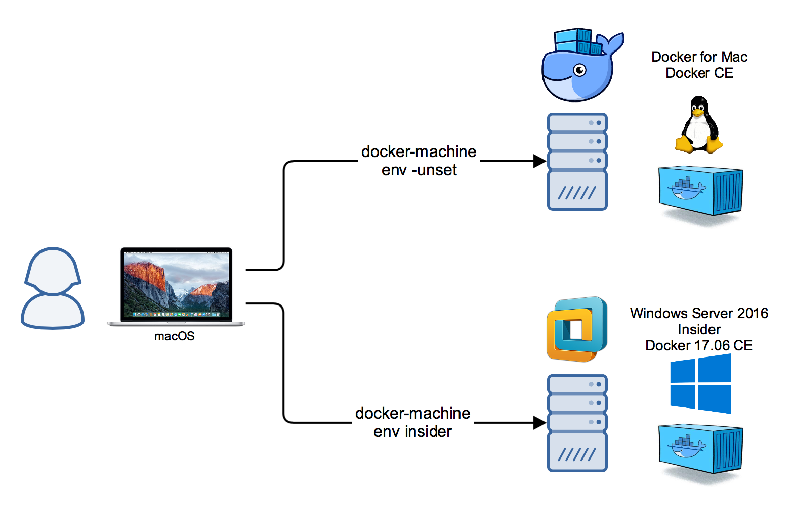

# Windows Server 2016 Insider with Docker

**Deprecation Notice: Please use the [windows-docker-machine](https://github.com/StefanScherer/windows-docker-machine) repo and with `vagrant up insider`. This repo is no longer maintained.**

This is a special version of my [windows-docker-machine](https://github.com/StefanScherer/windows-docker-machine) repo for the Windows Server Insider Preview. Get in touch with Windows Containers and the much smaller nanoserver-insider Docker image on your Mac, Linux or Windows machine. Create a local VM that runs in parallel to Docker for Mac/Win.



It is tested on a Mac with the following steps.

1. Register at Windows Insider program https://insider.windows.com

2. Download the Windows Server ISO from https://www.microsoft.com/en-us/software-download/windowsinsiderpreviewserver?wa=wsignin1.0

3. Build the Vagrant basebox with Packer

```bash
git clone https://github.com/StefanScherer/packer-windows
cd packer-windows
packer build --only=vmware-iso --var iso_url=~/Downloads/Windows_InsiderPreview_Server_2_16278.iso windows_2016_insider.json
vagrant box add windows_2016_insider windows_2016_insider_vmware.box
```

This Vagrant box has Docker 17.09.0-ce-rc2 installed and the following base images are already pulled from Docker Hub:

  * microsoft/windowsservercore-insider
  * microsoft/nanoserver-insider

There is also some languages and runtimes available as insider images:

  * microsoft/nanoserver-insider-powershell (only 16267)
  * microsoft/nanoserver-insider-dotnet (only 16267)
  * stefanscherer/node-windows:8.4.0-insider
  * stefanscherer/golang-windows:1.9-insider

4. Boot the VM

```
git clone https://github.com/StefanScherer/insider-docker-machine
cd insider-docker-machine
vagrant up
```

It will create TLS certs and create a Docker Machine entry "insider" so you can
switch very easily between Docker 4 Mac/Win and this Insider VM.

5. Switch to the Insider Docker machine

```
eval $(docker-machine env insider)
docker version
docker images
```

6. Switch back to Docker for Mac/Windows

```
eval $(docker-machine env -unset)
```

## LCOW - Linux Container on Windows

With this Windows Insider and the nightly version of the Docker engine for Windows you also can get in touch with the preview of LCOW. Running Linux containers on Windows

To have LCOW activated, prepare the `Vagrantfile` with these two provision scripts.

**Make sure to increase the memory of the VM to have more than 4 GByte RAM.**

```
  config.vm.provision "shell", path: "scripts/update-nightly-docker.ps1"
  config.vm.provision "shell", path: "scripts/install-xenial-container.ps1"
```

Now run `vagrant up` and you are able to try out the first preview of LCOW.

```
$ docker run alpine uname -a
Unable to find image 'alpine:latest' locally
latest: Pulling from library/alpine
88286f41530e: Pull complete
Digest: sha256:f006ecbb824d87947d0b51ab8488634bf69fe4094959d935c0c103f4820a417d
Status: Downloaded newer image for alpine:latest
Linux 9e55395dc078 4.11.0-1010-azure #10~lcow3-Ubuntu SMP Mon Sep 11 16:36:39 UTC 2017 x86_64 Linux
```
